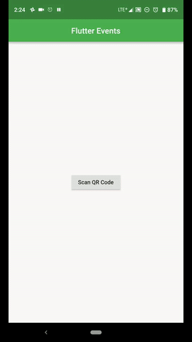

# Flutter Events
This App is a schedule app for conferences and large events. A user can easily access the schedule of the event they are attending and the organizers do not need to code at all to make this happen.

## Ideal Use Case
The ideal use case of this app is that a user is going to a conference and they would like to have the schedule of the conference on their phone. The conference organiser would need to put a QR code somewhere(booklet, id-badge, website). The user would pull out their device and scan the QR code, and they would have the schedule of the event. On the part of the event organisers, they would only need to create a json file(like the sample) that has all of the data, host it somewhere(like http://myjson.com/) and create a qr code(using something like https://www.qr-code-generator.com/). This is all they would need to have their own conference app (zero coding required). There are plenty of customization available through the json file to personalize the schedule.

## How to Use the App(User)
When you open the app you will see a button to scan the qr code. When you click it, your camera will open can you can scan a qr code(If there is an error page, please quit the app, restart, and try again). Note that internet access is required for this app. Once the data is loaded, you will see the schedule of your event. Once you scan your app, the event will be remembered so next time you open the app, you will see your event. If you want to scan a different qr from the event page, just click the camera at the top right hand corner and the camera will be opened and you can scan the qr code for a different event.

## How to Set up the Qr code(Event Organiser)
Create a JSON File based on sample_json.json included in the zip file. That file will explain what each field is expecting. You can customize the theme by your choice of font, colors, and brightness. Once you have created the json file, it should be hosted at some url. The qr code should be a link to that url.

## Information for using the App
The app has been tested on android(Essential Ph-1) but should be usable on iOS as there is no platform specific code. I have included 3 sample schedules with the app. The QR codes from them are Ces.png, Google.png, Sample.png. The json files that generate these schedules are also included and are named similarly. The first two are made to look similar to schedules from apps found on the play story to show the flexibility of the customization options. The last one is my own sample schedule.
 - The Ces.png creates a schedule that mimics the theme of the CES 2019 app
 - The Google.png creates a schedule that mimics the theme of the Google IO 2018 app
To test the app, you can also create your own json file based on the sample and qr code from hosted link to create your own schedule.

## Flutter Create
This app was created as my submission for #FlutterCreate. If the spaces and newline characters are removed, the main dart file will be under the 5K limit. 

## Tools Used
- Flutter
- Android Studio
- http://myjson.com to host the json
- https://www.qr-code-generator.com to create the QR codes

# Author and License
This app was created by Noel Jacob (noejac123@gmail.com), from Houston Texas.
This app is license under MIT open source, see LICENSE.md for more details.

